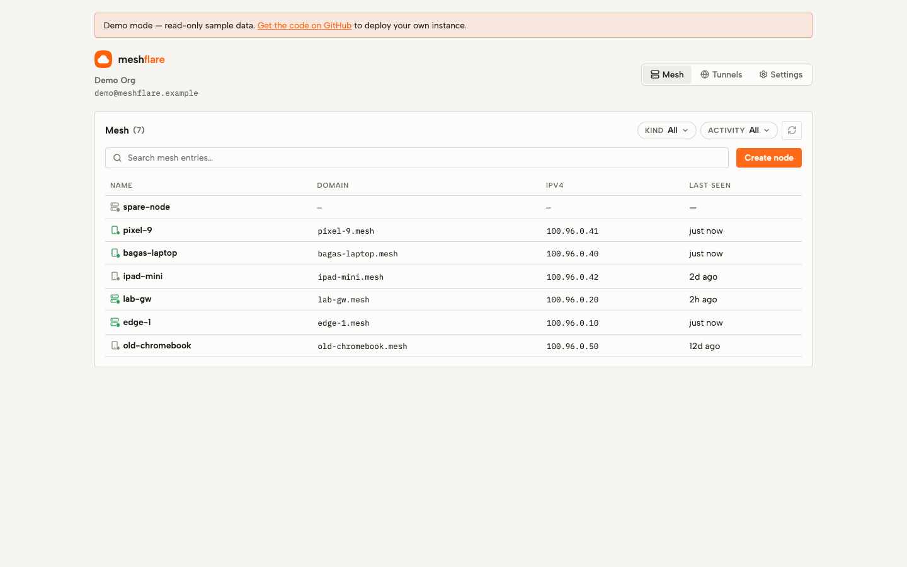
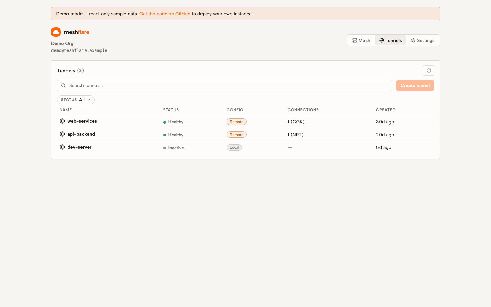
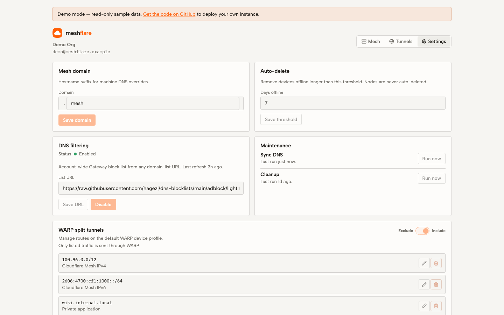

# meshflare

Cloudflare Mesh and Tunnel manager.

**Demo:** [meshflare-demo.wastu.workers.dev](https://meshflare-demo.wastu.workers.dev) · read-only

[](https://deploy.workers.cloudflare.com/?url=https://github.com/bgwastu/meshflare)

<p align="center">
  <picture>
    <source media="(prefers-color-scheme: dark)" srcset="docs/screenshots/demo-mesh-dark.png">
    
  </picture>
</p>

<p align="center">
  <picture>
    <source media="(prefers-color-scheme: dark)" srcset="docs/screenshots/demo-tunnels-dark.png">
    
  </picture>
</p>

<p align="center">
  <picture>
    <source media="(prefers-color-scheme: dark)" srcset="docs/screenshots/demo-settings-dark.png">
    
  </picture>
</p>

## Features

- Mesh node and device management
- Cloudflare Tunnel and ingress management
- Automatic Mesh DNS names
- CIDR and hostname routes
- WARP split-tunnel management
- DNS filtering
- Offline-device cleanup
- WARP connector setup commands

## Cloudflare

The Deploy button creates an independent Worker and D1 database in your Cloudflare account.

Required:

- Cloudflare account ID
- Scoped Cloudflare account API token

Required token permissions:

- Zero Trust Read
- Zero Trust Write
- Secure DNS Locations Write
- Cloudflare Tunnel permissions, if managing Tunnels

For automatic production deployments, connect the repository to the Worker with
**Workers & Pages > Settings > Builds**:

```text
Build:   bun install --frozen-lockfile && bun run build
Deploy:  bun run deploy
Branch:  main
```

Build variables:

```text
CLOUDFLARE_ACCOUNT_ID
MESHFLARE_D1_DATABASE_ID
```

Runtime secrets:

```text
CLOUDFLARE_API_TOKEN
MESHFLARE_PASSWORD   # optional, 32+ characters
```

## Self-Hosted

Self-hosted mode uses Bun and SQLite.

```bash
cp .env.example .env
bun install
bun run db:migrate
bun run dev
```

Docker:

```bash
docker run --rm -p 3000:3000 \
  -v meshflare-data:/data \
  -e CLOUDFLARE_ACCOUNT_ID=... \
  -e CLOUDFLARE_API_TOKEN=... \
  -e MESHFLARE_PASSWORD=... \
  ghcr.io/bgwastu/meshflare:latest
```

## Configuration

| Variable | Description |
|---|---|
| `CLOUDFLARE_ACCOUNT_ID` | Cloudflare account ID |
| `CLOUDFLARE_API_TOKEN` | Cloudflare account API token |
| `MESHFLARE_PASSWORD` | Optional dashboard password, minimum 32 characters |
| `DATA_DIR` | SQLite directory; default `./data` or `/data` in Docker |
| `PORT` | Self-hosted port; default `3000` |
| `DEMO_MODE` | Enables read-only demo fixtures |
